# <p align="center">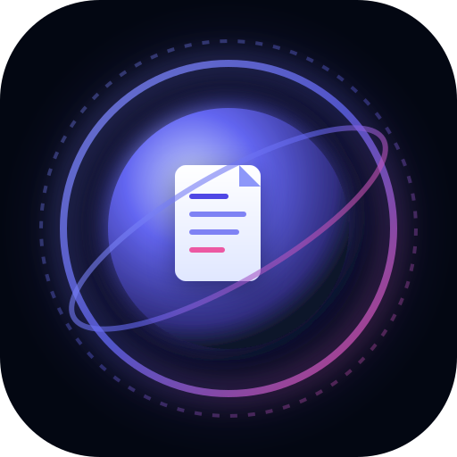<br/>NoteSphere OS v2.5.0</p>

<p align="center">
  <b>Персональная Операционная Система & ИИ-Кокпит нового поколения</b><br/>
  Единое цифровое пространство для заметок, задач, визуального мышления, финансов, медиа и проектов.
</p>

<p align="center">
  
  
  
  
  
  
  
</p>

<p align="center">
  <a href="https://github.com/LazizYT/NoteSphere/releases/tag/v2.5.0">
    
  </a>
  <a href="https://github.com/LazizYT/NoteSphere/releases/tag/v2.5.0">
    
  </a>
  <a href="https://github.com/LazizYT/NoteSphere/releases/tag/v2.5.0">
    
  </a>
</p>

---

## 📸 Галерея интерфейса

### ⚡ 1. Главный рабочий стол (Widgets & Cockpit)
> Интерактивный дашборд: фокус дня, тайм-трекинг, привычки, помодоро и расписание.

<p align="center">
  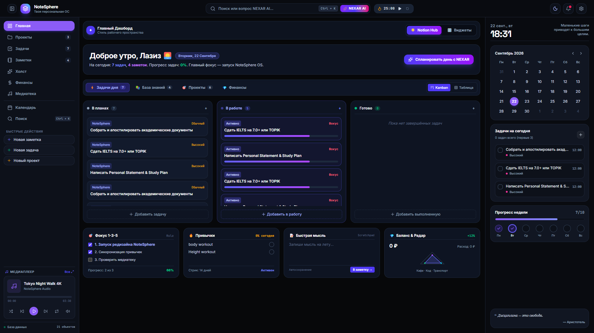
</p>

---

### 📝 2. Заметки и База знаний (Digital Second Brain)
> Двусторонние связи [[Wikilinks]], теги, полнотекстовый поиск, версионирование и экспорт.

<p align="center">
  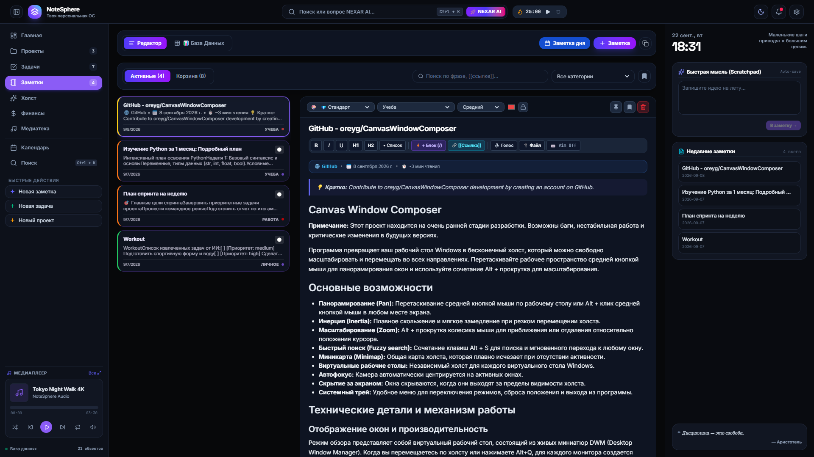
</p>

---

### ✅ 3. Задачи, Канбан и Матрица Эйзенхауэра
> Смарт-фильтры по датам, тайм-блокинг, чеклисты подзадач, доска задач и долгосрочные цели.

<p align="center">
  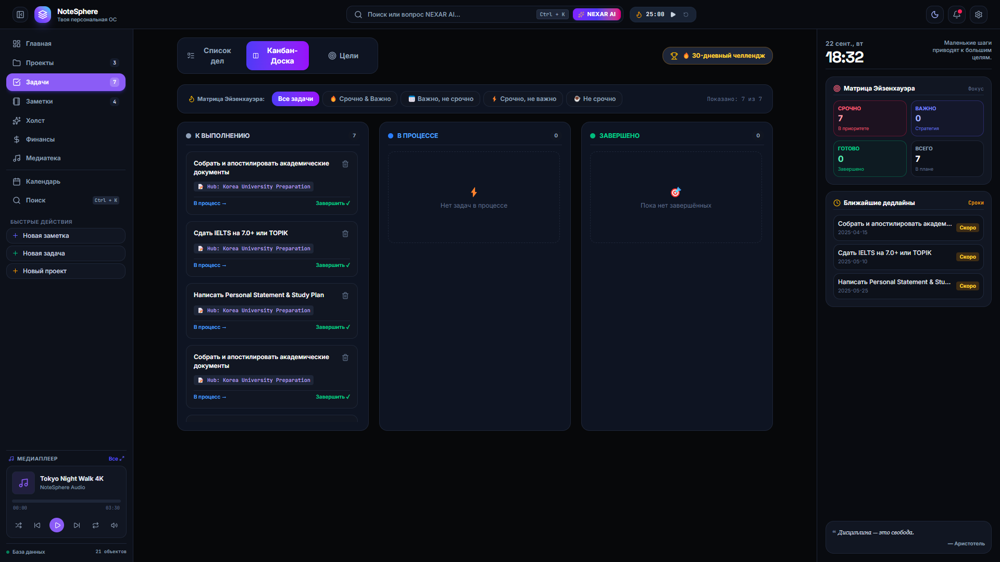
</p>

<p align="center">
  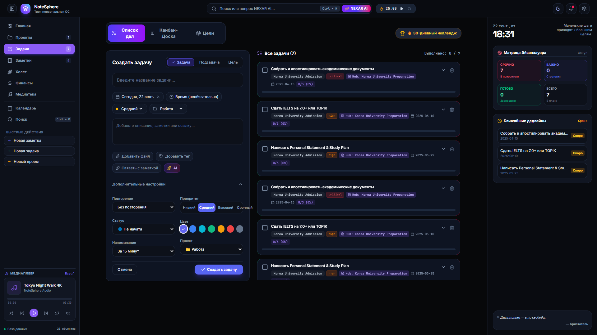
</p>

---

### 🎨 4. Холст и Ментальные карты (Canvas Creative Space)
> Бесконечная интерактивная доска для карточек, связей, идей и архитектурных схем.

<p align="center">
  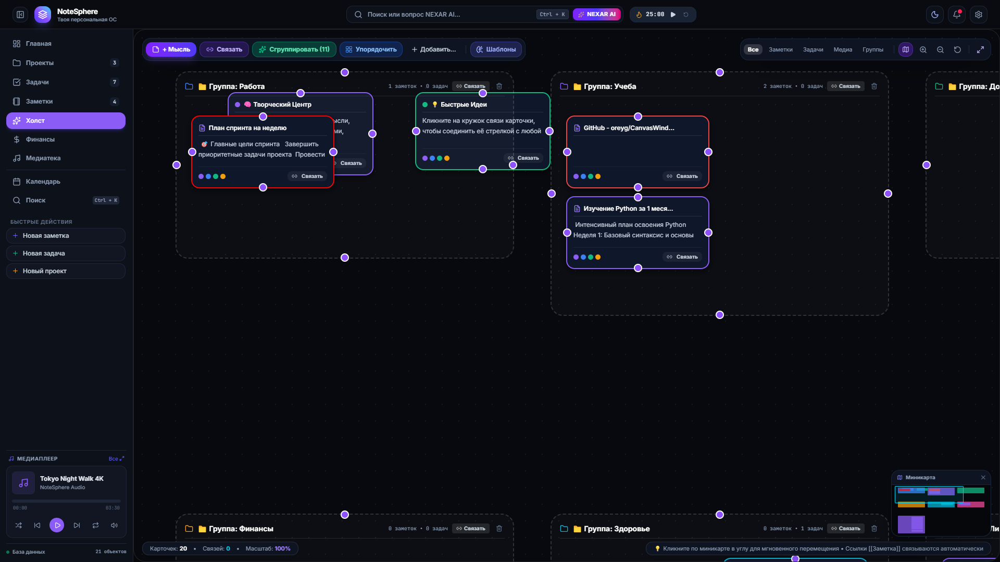
</p>

---

### 💰 5. Финансовый трекер и Бюджет
> Доходы, расходы, категории трат, баланс и отслеживание финансовых целей.

<p align="center">
  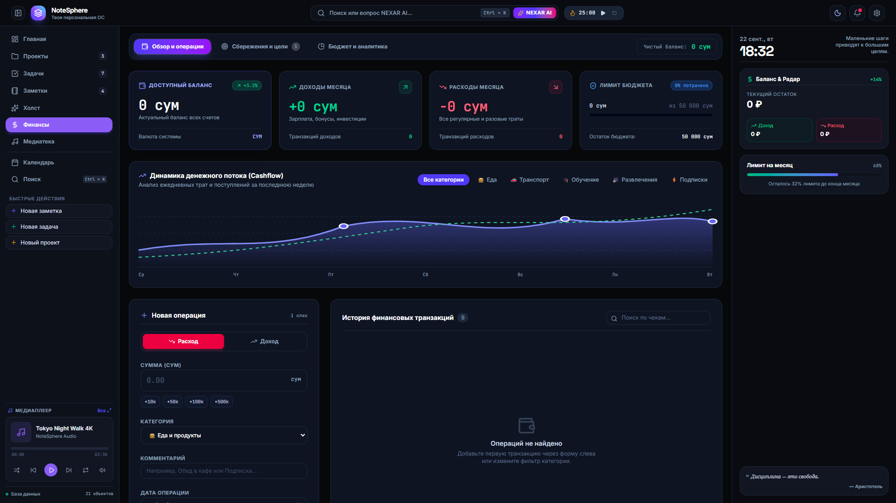
</p>

---

### 🎵 6. Медиатека (Аудио, Видео, Фото Студия)
> Локальный плеер с извлечением обложек ID3, плейлистами для музыки и видео, галереей фото.

<p align="center">
  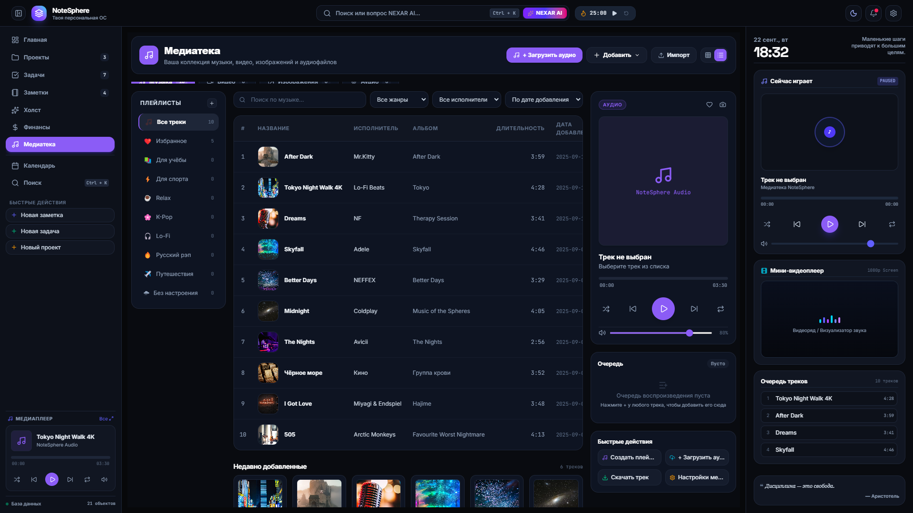
</p>

---

### 🚀 7. Хаб проектов и Экосистемное управление
> Проектные дашборды, майлстоуны, связанные заметки, задачи и аналитика прогресса.

<p align="center">
  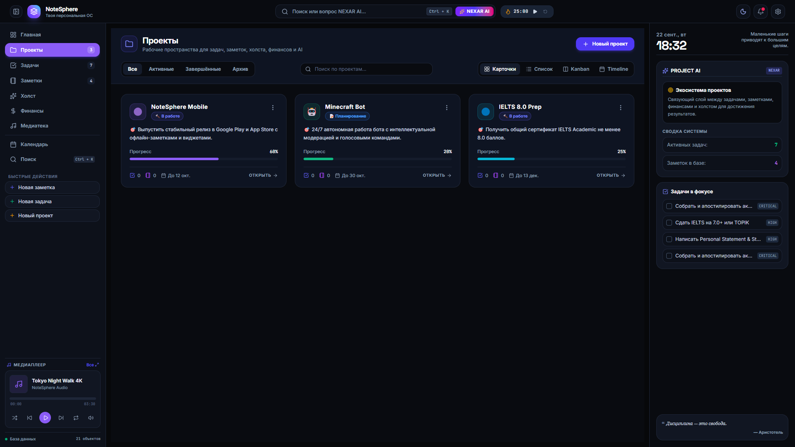
</p>

---

### 🤖 8. Командный центр & NEXAR AI Copilot (`Ctrl + K`)
> Умный поиск по всей системе, управление горячими клавишами и автономный ИИ-помощник.

<p align="center">
  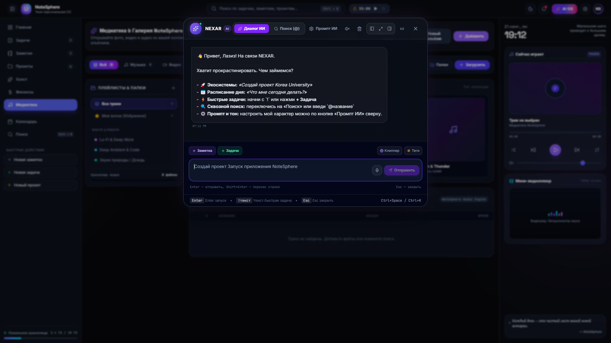
</p>

---

### ☀️ 9. Темы оформления (OLED Dark & Чистый Light)
> Поддержка ультра-тёмной OLED темы, светлого режима, кастомных обоев и неонового свечения.

<p align="center">
  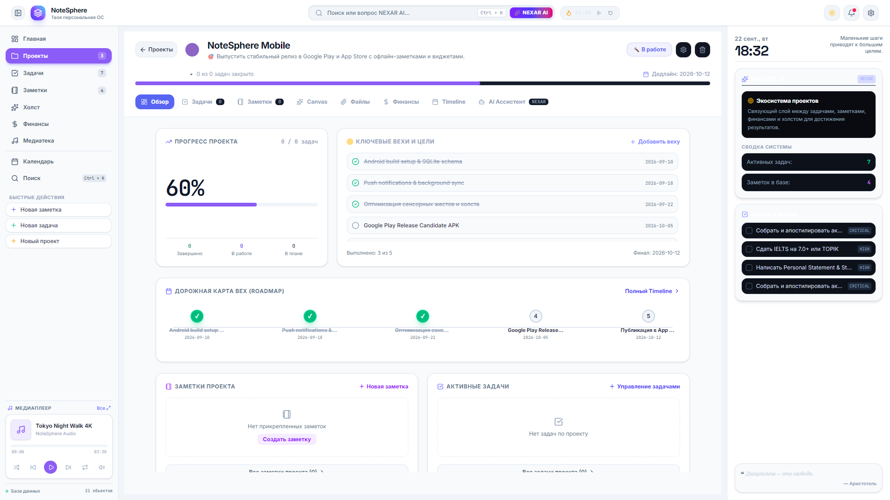
</p>

---

## 🚀 Основные возможности

- 🧠 **NEXAR AI Copilot:** встроенный ИИ-ассистент, умеющий строить проекты, распределять задачи, вести бюджет и отвечать на вопросы.
- 📂 **Офлайн-первичность (Local-First):** данные хранятся локально в IndexedDB и `localStorage`, быстрый экспорт/импорт в JSON.
- 🔒 **Безопасность:** PIN-код защита, локальное шифрование, отсутствие сторонней слежки.
- 📱 **Кроссплатформенность:**
  - **Web**: чистый PWA-клиент
  - **Desktop (Windows EXE)**: сборка на базе Electron
  - **Mobile (Android APK)**: сборка через Capacitor
- 🔄 **Синхронизация:** поддержка WebDAV и Telegram Cloud Backup.

---

## 🛠️ Запуск и разработка

```bash
# 1. Установка зависимостей
npm install

# 2. Запуск в режиме разработки
npm run dev

# 3. Сборка продакшн веб-версии
npm run build

# 4. Сборка десктопного приложения (EXE)
npm run build:exe

# 5. Сборка мобильного приложения (APK)
npm run build:apk
```

---

<p align="center">
  Разработано с ❤️ для максимальной продуктивности • <b>NoteSphere OS</b>
</p>
